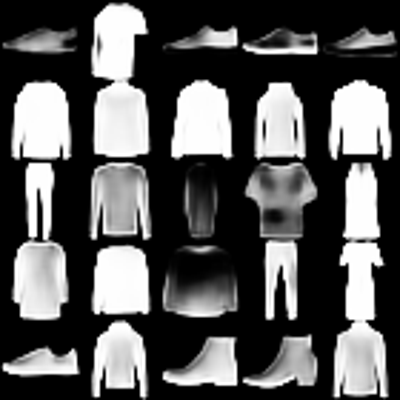
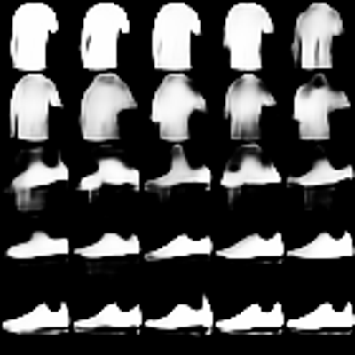

# Fashion MNIST - VAE
## Purpose
The purpose of this repository is to train different forms of Variational Autoencoders (VAEs) on the Fashion MNIST dataset to better understand the capabilities and inner workings of this modeling technique, specifically for generative purposes.
Furthermore, a secondary goal is to become more familiar with the Python package Pyro for probabilistic programming, with which the VAEs in this repo have been trained.

## Reference
The work in this repository is heavily inspired by the VAE Tutorials found in the documentation of the [Pyro project](https://docs.pyro.ai/en/stable/), although the used data is the FashionMNIST dataset and the specific implementation deviates from the Pyro tutorial.

For an introduction to VAEs with Pyro, please see [here](https://pyro.ai/examples/vae.html).

For a more general introduction to Pyro with an example implementation of a VAE for the MNIST Digits dataset, including exercises and solutions, please see [here](https://github.com/pyladiesams/pyro-may2023).

For a discussion of the choices made in this repository, please refer to this [Medium Article](https://medium.com/@cagliagiulia42/2fd45d068ae0).

## Getting Started
### Dependencies
To use the code in this repository, please clone it to your local or remote machine with:

```bash
git clone https://github.com/GiuliaCaglia/fashion-mnist-vae.git
```

All dependencies can be installed with 
```bash
poetry install
```
if you use [poetry](https://python-poetry.org/) for dependency management, or

```bash
pip3 install -r requirements.txt
```

otherwise.

When not using poetry, it is recommended, to use another environment management system, such as [pipenv](https://pipenv.pypa.io/en/latest/), [conda](https://conda.io/projects/conda/en/latest/user-guide/getting-started.html) or [virtualenv](https://docs.python.org/3/library/venv.html).

Note, that the requirements.txt file includes cuda dependencies and that the required Python version is >=3.11. This repository might work with other Python versions, but it has not been tested for them.

### Training Models
Once dependencies are installed, a VAE can be trained with:
```bash
python3 src/fashion_mnist_vae/scripts/train_vae.py -e $EPOCHS -d $DEVICE
```
Where:
- `EPOCHS` denotes the number of epochs for which to train the model
- `DEVICE` is one of `cuda` or `cpu` (default)

The loss plot, example images and the model itself will be stored in the `assets` folder, once training is concluded.

## Results
The results are assessed in more detail in `notebooks/Visualizations & Samples.ipynb`.

Here, we see samples generated by the VAE:



And here we see how two items morph into each other as we move through the latent space.

